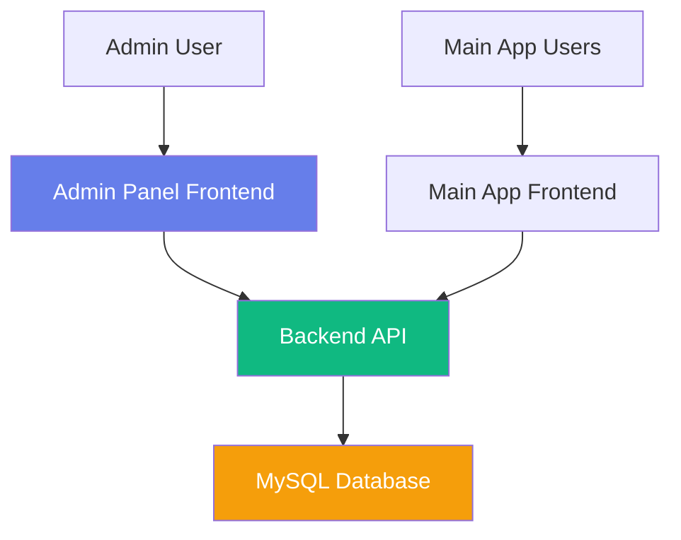

# 🏗️ Admin Panel Architecture

## System Architecture & Data Flow

---

## 📐 High-Level Architecture



---

## 🔄 Component Architecture

```
┌─────────────────────────────────────────────────────────┐
│                    Admin Panel (Port 3001)              │
├─────────────────────────────────────────────────────────┤
│                                                          │
│  ┌────────────────┐         ┌─────────────────┐        │
│  │   App.jsx      │────────▶│  Theme Provider │        │
│  │   (Router)     │         │  (Material-UI)  │        │
│  └────────┬───────┘         └─────────────────┘        │
│           │                                              │
│           │                                              │
│  ┌────────▼──────────────────────────────────┐          │
│  │         Protected Routes                  │          │
│  │  ┌────────────────────────────────────┐   │          │
│  │  │     DashboardLayout                │   │          │
│  │  │  ┌──────────┐  ┌───────────────┐  │   │          │
│  │  │  │ Sidebar  │  │ Main Content  │  │   │          │
│  │  │  │ Menu     │  │  ┌─────────┐  │  │   │          │
│  │  │  └──────────┘  │  │  Pages  │  │  │   │          │
│  │  │                │  └─────────┘  │  │   │          │
│  │  └────────────────────────────────┘   │          │
│  └────────────────────────────────────────┘          │
│                                                          │
└─────────────────────────────────────────────────────────┘
```

---

## 📦 Folder Structure Explained

```
admin_panel/
│
├── src/                          # Source code
│   │
│   ├── components/               # Reusable components
│   │   ├── common/               # Shared UI components
│   │   │   ├── StatsCard.jsx    # Metric display card
│   │   │   ├── LoadingSpinner   # Loading state
│   │   │   └── EmptyState       # No data state
│   │   │
│   │   └── layout/               # Layout components
│   │       └── DashboardLayout  # Main layout with sidebar
│   │
│   ├── pages/                    # Page components (routes)
│   │   ├── LoginPage            # Authentication
│   │   ├── DashboardPage        # Overview
│   │   ├── StudentsPage         # Student management
│   │   ├── SeniorsPage          # Senior management
│   │   ├── DonatorsPage         # Donator management
│   │   ├── AnalyticsPage        # Reports & charts
│   │   ├── RequestsPage         # Request tracking
│   │   └── UsersPage            # All users
│   │
│   ├── services/                 # API & external services
│   │   └── api.js               # Axios instance + endpoints
│   │
│   ├── App.jsx                   # Root component + routing
│   ├── theme.js                  # Material-UI theme
│   ├── main.jsx                  # Entry point
│   └── index.css                 # Global styles
│
├── public/                       # Static assets
├── package.json                  # Dependencies
├── vite.config.js                # Vite configuration
├── index.html                    # HTML template
├── .env                          # Environment variables
└── README.md                     # Documentation
```

---

## 🔐 Authentication Flow

```
┌──────────────┐
│  Admin User  │
└──────┬───────┘
       │
       │ 1. Enter credentials
       ▼
┌──────────────────┐
│   LoginPage.jsx  │
└──────┬───────────┘
       │
       │ 2. POST /api/admin/login
       ▼
┌──────────────────────┐
│  admin.controller.js │
│  - Verify credentials│
│  - Generate JWT      │
└──────┬───────────────┘
       │
       │ 3. Return token + user
       ▼
┌──────────────────┐
│   localStorage   │
│  - adminToken    │
│  - adminUser     │
└──────┬───────────┘
       │
       │ 4. Navigate to dashboard
       ▼
┌──────────────────┐
│  DashboardPage   │
└──────────────────┘

All API requests include:
Authorization: Bearer <token>
```

---

## 🔄 Data Flow Example: Fetching Students

```
┌────────────────┐
│ StudentsPage   │  Component mounts
└────────┬───────┘
         │
         │ 1. useEffect(() => fetchStudents())
         ▼
┌────────────────┐
│   api.js       │  usersAPI.getStudents()
└────────┬───────┘
         │
         │ 2. GET /api/admin/students
         │    Headers: { Authorization: Bearer <token> }
         ▼
┌────────────────────┐
│  adminAuth.js      │  Verify JWT & role
│  (Middleware)      │
└────────┬───────────┘
         │
         │ 3. Token valid, role = admin
         ▼
┌─────────────────────┐
│ admin.controller.js │  getStudents()
└────────┬────────────┘
         │
         │ 4. Query database
         ▼
┌─────────────────────┐
│  Student Model      │  Sequelize query
│  (Database)         │
└────────┬────────────┘
         │
         │ 5. Return student data
         ▼
┌─────────────────────┐
│  Backend Response   │  JSON array
└────────┬────────────┘
         │
         │ 6. response.data
         ▼
┌────────────────┐
│ StudentsPage   │  setStudents(data)
│  - Render table│
│  - Show stats  │
└────────────────┘
```

---

## 🎯 Routing Structure

```
App.jsx (Root)
│
├── /login (Public)
│   └── LoginPage
│
└── / (Protected by ProtectedRoute)
    └── DashboardLayout
        │
        ├── / (index)
        │   └── DashboardPage
        │
        ├── /users
        │   └── UsersPage
        │       ├── Tab: Students
        │       ├── Tab: Seniors
        │       └── Tab: Donators
        │
        ├── /students
        │   └── StudentsPage
        │
        ├── /seniors
        │   └── SeniorsPage
        │
        ├── /donators
        │   └── DonatorsPage
        │
        ├── /analytics
        │   └── AnalyticsPage
        │
        └── /requests
            └── RequestsPage
```

---

## 📊 State Management

### Local Component State (useState)
```javascript
// Each page manages its own state
const [loading, setLoading] = useState(true);
const [data, setData] = useState([]);
const [filteredData, setFilteredData] = useState([]);
const [searchQuery, setSearchQuery] = useState('');
```

### Global State (localStorage)
```javascript
// Authentication state
localStorage.setItem('adminToken', token);
localStorage.setItem('adminUser', JSON.stringify(user));

// Retrieved in api.js interceptor
const token = localStorage.getItem('adminToken');
```

### No Redux/Context Needed
- Simple state requirements
- Page-level state sufficient
- API calls are stateless

---

## 🔌 API Service Layer

```javascript
// services/api.js

// Base axios instance
const api = axios.create({
  baseURL: '/api',
  headers: { 'Content-Type': 'application/json' }
});

// Request interceptor (add token)
api.interceptors.request.use(config => {
  const token = localStorage.getItem('adminToken');
  if (token) {
    config.headers.Authorization = `Bearer ${token}`;
  }
  return config;
});

// Response interceptor (handle errors)
api.interceptors.response.use(
  response => response,
  error => {
    if (error.response?.status === 401) {
      // Logout and redirect
    }
    return Promise.reject(error);
  }
);

// API endpoints grouped by resource
export const usersAPI = {
  getStudents: () => api.get('/admin/students'),
  getSeniors: () => api.get('/admin/seniors'),
  // ...
};
```

---

## 🎨 Theming Architecture

```javascript
// theme.js

createTheme({
  palette: {
    primary: { main: '#667eea' },
    secondary: { main: '#764ba2' },
    // ... semantic colors
  },
  typography: {
    fontFamily: 'Inter, sans-serif',
    // ... type scale
  },
  components: {
    MuiButton: {
      styleOverrides: {
        root: { /* custom styles */ }
      }
    },
    // ... component overrides
  }
});
```

Applied globally via ThemeProvider in App.jsx

---

## 📱 Responsive Design Strategy

### Breakpoints (Material-UI default)
```
xs: 0px      (Extra small, mobile)
sm: 600px    (Small, mobile landscape)
md: 900px    (Medium, tablet)
lg: 1200px   (Large, desktop)
xl: 1536px   (Extra large, wide desktop)
```

### Responsive Patterns
```javascript
// Hook-based
const isMobile = useMediaQuery(theme.breakpoints.down('md'));

// Render logic
{isMobile ? <MobileDrawer /> : <PermanentSidebar />}

// Grid system
<Grid container spacing={3}>
  <Grid item xs={12} sm={6} md={3}>
    <StatsCard />
  </Grid>
</Grid>
```

---

## 🔒 Security Layers

```
┌─────────────────────────────────────┐
│  Layer 1: Frontend Route Protection │
│  - ProtectedRoute component         │
│  - Checks localStorage for token    │
│  - Redirects to /login if missing   │
└─────────────────┬───────────────────┘
                  │
┌─────────────────▼───────────────────┐
│  Layer 2: API Request Headers       │
│  - Authorization: Bearer <token>    │
│  - Added by axios interceptor       │
└─────────────────┬───────────────────┘
                  │
┌─────────────────▼───────────────────┐
│  Layer 3: Backend Middleware        │
│  - adminAuth.js verifies JWT        │
│  - Checks role === 'admin'          │
│  - Returns 401/403 if invalid       │
└─────────────────┬───────────────────┘
                  │
┌─────────────────▼───────────────────┐
│  Layer 4: Controller Logic          │
│  - Sanitizes data (no passwords)    │
│  - Input validation                 │
│  - Database queries                 │
└─────────────────────────────────────┘
```

---

## 🗄️ Database Integration

```
┌──────────────────────────────────────┐
│         MySQL Database               │
│  (student_senior_db)                 │
├──────────────────────────────────────┤
│                                      │
│  Tables:                             │
│  ├── students                        │
│  ├── seniors                         │
│  ├── donations                       │
│  ├── senior_requests                 │
│  ├── student_interests               │
│  ├── student_certifications          │
│  ├── student_feedback                │
│  ├── senior_feedback                 │
│  └── otp_tokens                      │
│                                      │
└──────────────┬───────────────────────┘
               │
               │ Sequelize ORM
               │
┌──────────────▼───────────────────────┐
│     Backend Models (Sequelize)       │
│  ├── Student.js                      │
│  ├── Senior.js                       │
│  ├── Donation.js                     │
│  └── ... etc                         │
└──────────────┬───────────────────────┘
               │
               │ Used by
               │
┌──────────────▼───────────────────────┐
│    Admin Controller Methods          │
│  ├── getStudents()                   │
│  ├── getSeniors()                    │
│  ├── getDonations()                  │
│  └── getDashboardStats()             │
└──────────────────────────────────────┘
```

---

## 🚀 Build & Deployment Flow

```
Development:
┌────────────────┐
│  npm run dev   │  → Vite dev server (port 3001)
└────────────────┘    Hot reload enabled

Production Build:
┌────────────────┐
│ npm run build  │  → Creates dist/ folder
└────────┬───────┘
         │
         ▼
┌────────────────────────┐
│  dist/                 │
│  ├── index.html        │
│  ├── assets/           │
│  │   ├── index-abc.js  │  (bundled & minified)
│  │   └── index-xyz.css │  (optimized)
│  └── vite.svg          │
└────────┬───────────────┘
         │
         ▼
┌────────────────────────┐
│  Deploy to:            │
│  ├── Netlify           │
│  ├── Vercel            │
│  ├── AWS S3 + CloudFront│
│  ├── Your web server   │
│  └── Any static hosting│
└────────────────────────┘
```

---

## 🔄 Error Handling Flow

```
API Call
   │
   ├─ Success → Update state → Render data
   │
   └─ Error
       │
       ├─ 401 Unauthorized
       │   └─ Logout → Redirect to /login
       │
       ├─ 403 Forbidden
       │   └─ Show error toast
       │
       ├─ 404 Not Found
       │   └─ Show empty state
       │
       ├─ 500 Server Error
       │   └─ Show error toast
       │
       └─ Network Error
           └─ Show retry option
```

---

## 📊 Chart Architecture

```javascript
// Using Recharts library

<ResponsiveContainer width="100%" height={300}>
  <LineChart data={chartData}>
    <CartesianGrid />    {/* Grid lines */}
    <XAxis dataKey="name" />  {/* X-axis */}
    <YAxis />            {/* Y-axis */}
    <Tooltip />          {/* Hover details */}
    <Legend />           {/* Labels */}
    <Line 
      type="monotone" 
      dataKey="students" 
      stroke="#667eea" 
    />
  </LineChart>
</ResponsiveContainer>
```

Supported chart types:
- LineChart (trends)
- BarChart (comparisons)
- AreaChart (stacked data)
- PieChart (distribution)

---

## 🎯 Performance Considerations

### Frontend
```javascript
// Code splitting
const DashboardPage = lazy(() => import('./pages/DashboardPage'));

// Memoization
const ExpensiveComponent = useMemo(() => {
  return <ComplexCalculation data={data} />;
}, [data]);

// Pagination
<TablePagination 
  rowsPerPageOptions={[5, 10, 25, 50]}
  count={total}
  rowsPerPage={rowsPerPage}
/>
```

### Backend
```javascript
// Limit fields returned
Student.findAll({
  attributes: { exclude: ['passwordHash', 'idProofUrl'] }
});

// Pagination
Student.findAll({
  limit: pageSize,
  offset: page * pageSize
});
```

---

## 🔧 Configuration Files

### vite.config.js
```javascript
export default defineConfig({
  plugins: [react()],
  server: {
    port: 3001,
    proxy: {
      '/api': 'http://localhost:4000'  // Proxy API calls
    }
  }
});
```

### .env
```
VITE_API_URL=http://localhost:4000/api
VITE_APP_NAME=Government App Admin Panel
VITE_APP_VERSION=1.0.0
```

---

## 📋 Summary

The admin panel architecture is:

✅ **Modular** - Clear separation of concerns  
✅ **Scalable** - Easy to add new features  
✅ **Secure** - Multiple security layers  
✅ **Maintainable** - Well-organized code  
✅ **Performant** - Optimized for speed  
✅ **Responsive** - Works on all devices  
✅ **Documented** - Comprehensive guides  

**A professional, production-ready architecture!** 🎉
